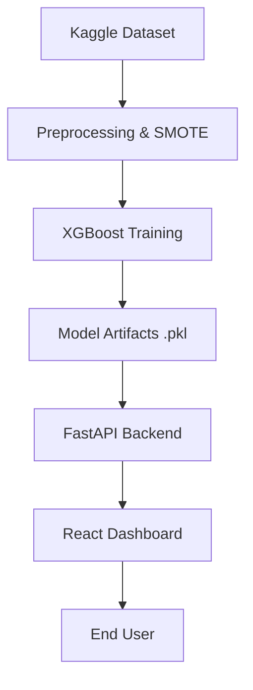

# 🛡️ Credit Card Fraud Detection System

An end-to-end machine learning solution for real-time credit card fraud detection. This project implements a robust pipeline from exploratory data analysis to a production-ready API and an interactive React-based dashboard.

[](https://python.org)
[](https://xgboost.ai)
[](https://reactjs.org)
[](https://fastapi.tiangolo.com)
[](https://vite.dev)

---

## 📋 Project Overview

Credit card fraud represents a significant challenge for financial institutions. With only **0.17%** of transactions being fraudulent, the data is extremely imbalanced. This project focuses on maximizing **Recall** to ensure fraudulent activities are identified accurately without being masked by the high volume of legitimate transactions.

### Key Features
- **Imbalance Handling**: Utilizes SMOTE (Synthetic Minority Over-sampling Technique) to address class imbalance.
- **Model Comparison**: Evaluates Logistic Regression, Random Forest, and XGBoost.
- **Production Architecture**: FastAPI backend serving a modern React/Vite frontend.
- **Real-time Scoring**: Scalable API for single and batch transaction scoring.
- **Automated Testing**: Comprehensive unit tests for preprocessing and API integrity.

---

## 📊 Methodology & Performance

### 1. Data Processing
- **Source**: Kaggle Credit Card Fraud Detection dataset (284,807 transactions).
- **Scaling**: Robust scaling of `Amount` and `Time` features.
- **Sampling**: SMOTE applied exclusively to the training set to prevent data leakage.

### 2. Model Evaluation
The models were evaluated primarily on **Recall** to minimize false negatives (missed fraud).

| Model | Precision | Recall (After SMOTE) | F1-Score |
|---|---|---|---|
| Logistic Regression | 0.86 | 0.91 | 0.88 |
| Random Forest | 0.92 | 0.89 | 0.90 |
| **XGBoost ✅** | **0.90** | **0.92** | **0.91** |

---

## 🏗️ Architecture



---

## 🚀 Getting Started

### 1. Installation
Clone the repository and install the Python dependencies:
```bash
pip install -r requirements.txt
```

### 2. Dataset Setup
Download `creditcard.csv` from [Kaggle](https://www.kaggle.com/datasets/mlg-ulb/creditcardfraud) and place it in the `data/` directory.

### 3. Model Training
Train the models and generate performance metrics:
```bash
python -m src.train
```

### 4. Running the Application (Development)
Start the FastAPI backend:
```bash
uvicorn api.main:app --reload --port 8000
```

In a separate terminal, start the React frontend:
```bash
cd client
npm install
npm run dev
```

### 5. Running with Docker (Production)
The project includes a multi-stage `Dockerfile` that builds the React frontend and serves it via FastAPI:
```bash
docker build -t fraud-detection .
docker run -p 8000:8000 fraud-detection
```

---

## 🌐 API Documentation

Once the backend is running, interactive API documentation is available at:
- Swagger UI: `http://localhost:8000/docs`
- Redoc: `http://localhost:8000/redoc`

### Core Endpoints
- `GET /health`: System health and model status.
- `GET /stats`: Real-time dataset and model performance metrics.
- `POST /predict`: Predict fraud risk for a single transaction.
- `POST /predict/batch`: Batch processing for multiple transactions.

---

## 🧪 Testing
Run the test suite using `pytest`:
```bash
pytest tests/ -v
```

---

## 📄 License
Distributed under the MIT License. See `LICENSE` for more information.

© 2026 Credit Card Fraud Detection Project

